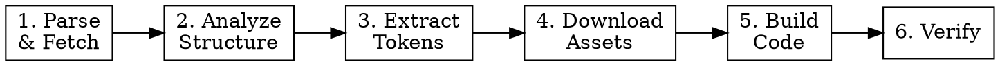

# Figma to Code

Convert Figma designs into pixel-perfect Next.js App Router pages and components with Tailwind CSS. The goal is 100% visual fidelity to the original design while producing responsive, production-ready code.

**Core principle:** The Figma design is the single source of truth. Do not add creative interpretation — replicate exactly what the designer intended.

## MCP Server Priority

This skill uses two Figma MCP servers. **Always prefer figma-bridge** — it provides a live connection to the running Figma app with richer data. Fall back to Framelink only when figma-bridge is unavailable or for file-based image downloads.

| Capability | Primary (figma-bridge) | Fallback (Framelink) |
|-----------|----------------------|---------------------|
| Fetch design tree | `get_document`, `get_node(nodeId)` | `get_figma_data(fileKey, nodeId)` |
| Summarized context | `get_design_context(depth?)` | — |
| Design tokens/styles | `get_styles`, `get_variable_defs` | Extract from `globalVars.styles` in get_figma_data response |
| Visual reference | `get_screenshot(nodeIds?, format?, scale?)` | — |
| Live selection | `get_selection` | — |
| File metadata | `get_metadata` | — |
| Download assets to disk | — | `download_figma_images(fileKey, nodes, localPath)` |

**Key difference:** figma-bridge's `get_screenshot` returns base64-encoded image data (useful for visual reference). Framelink's `download_figma_images` saves files directly to disk (required for actual asset extraction into the project).

## When to Use

- User provides a Figma URL (file or frame) and asks to build/implement/convert it
- User asks to implement a design while Figma is open (use figma-bridge live selection)
- URL contains `figma.com/design/` or `figma.com/file/` with a fileKey
- Optionally contains `node-id=` parameter targeting a specific frame

**Do NOT use when:**
- User wants creative design from scratch (use `frontend-design` skill instead)
- User wants to modify/redesign an existing Figma layout
- No Figma URL is provided AND no Figma selection context is available

## Process Pipeline

Follow these 6 phases in order. Do not skip phases or combine them.



### Phase 1: Parse & Fetch

**Option A — figma-bridge (preferred, live connection):**

If the user has Figma open with the target frame selected:
```
mcp__figma-bridge__get_selection()          → identify selected nodes
mcp__figma-bridge__get_node(nodeId)         → get full node tree for each
mcp__figma-bridge__get_design_context()     → get summarized tree structure
```

If the user provides a node ID directly:
```
mcp__figma-bridge__get_node(nodeId)         → nodeId in colon format "4029:12345"
```

For a visual reference of the target design:
```
mcp__figma-bridge__get_screenshot(nodeIds, format="PNG", scale=2)
```

**Option B — Framelink (URL-based fallback):**

When figma-bridge is unavailable or user provides only a URL:

Extract from the Figma URL:
- `fileKey`: the alphanumeric key after `/design/` or `/file/`
- `nodeId`: from `node-id=` URL param (format: `X:Y` or `X-Y`, convert `-` to `:`)

```
mcp__Framelink_Figma_MCP__get_figma_data(fileKey, nodeId)
```

**For both options:** If the response tree is very large, re-fetch specific subtrees using `nodeId` + `depth` parameter to get detail where needed.

### Phase 2: Analyze Structure

Walk the design tree and classify the output:

| Figma Pattern | Output Type | File Path |
|---------------|------------|-----------|
| Full screen/page frame | Page | `app/[route]/page.tsx` |
| Persistent nav/sidebar/footer | Layout | `app/[route]/layout.tsx` |
| Repeated element (cards, list items) | Component | `components/[Name].tsx` |
| One-off section within a page | Inline JSX | Keep inside page file |

**Decomposition rules:**
- Extract a component if it appears 2+ times in the design OR is clearly a standalone widget (button, card, input)
- If a frame has a Figma component name (type: COMPONENT or INSTANCE), it is likely reusable — create a component file
- One-off sections stay inline in the page — do not over-decompose
- Name components after their Figma layer name, converted to PascalCase

### Phase 3: Extract Design Tokens

**Option A — figma-bridge (preferred):**

Use dedicated endpoints for structured token extraction:
```
mcp__figma-bridge__get_styles()             → all local styles (colors, text, effects)
mcp__figma-bridge__get_variable_defs()      → variable collections and design tokens
```

These return structured data that maps directly to Tailwind config values.

**Option B — Framelink fallback:**

Manually pull tokens from `globalVars.styles` in the `get_figma_data` response.

**For both options, extract:**

**Colors** — scan all `fills` values:
```
Colour Styles/Primary Colour/Primary 100 → primary: "#129575"
Colour Styles/Neutral Colour/White → white (already default)
```
Map to `tailwind.config.ts` → `theme.extend.colors`.

**Typography** — scan all `textStyle` values:
```
fontFamily: Poppins → theme.extend.fontFamily.poppins
fontSize/weight combinations → document as reference for Tailwind classes
```
Use `next/font/google` to load fonts in `app/layout.tsx` with CSS variable approach.

**Spacing & Sizing** — note recurring gap, padding, margin, and dimension values from layout styles. Use Tailwind's default scale when values align (e.g., 16px = `gap-4`). Use arbitrary values `[Xpx]` when they don't align with the scale.

**Precision rule:** If a Figma value is within 1px of a Tailwind scale value, use the scale value. If it differs by 2px+, use an arbitrary value `[exact]` for pixel-perfect fidelity.

**Other tokens:** border-radius, shadows, opacity values → extend Tailwind config as needed.

### Phase 4: Download Assets

**For saving files to disk, use Framelink** — it's the only tool that writes files directly:

Use `mcp__Framelink_Figma_MCP__download_figma_images` to export all visual assets.

**For quick visual reference only** (not saving to disk), use figma-bridge:
```
mcp__figma-bridge__get_screenshot(nodeIds=["4029:12345"], format="SVG")   → vectors
mcp__figma-bridge__get_screenshot(nodeIds=["4029:12345"], format="PNG", scale=2) → raster
```
This returns base64-encoded data — useful for verification but does not save files.

**Icons and vectors** (type: VECTOR, BOOLEAN_OPERATION, IMAGE-SVG):
- Use `.svg` extension in `fileName`
- Save to: `public/icons/`

**Photos and raster images** (nodes with `imageRef` in their fills):
- Use `.png` extension in `fileName`
- Set `pngScale: 2` for retina quality
- **Must include `imageRef`** from the node's fill data — without it, the download will fail for raster images

**Exact Framelink API call format:**
```json
{
  "fileKey": "avabzt6B0TwyC3f9fBaWSw",
  "nodes": [
    {
      "nodeId": "18:217",
      "fileName": "splash-bg.png",
      "imageRef": "abb8bc9ad3d82b4122f5602afeadd620a4c53d15"
    },
    {
      "nodeId": "9:9",
      "fileName": "arrow-right.svg"
    }
  ],
  "localPath": "/absolute/path/to/project/public/images",
  "pngScale": 2
}
```

**Key rules:**
- `imageRef` is REQUIRED for raster images (photos, backgrounds) — find it in the node's `fills` array
- `imageRef` is OMITTED for vector/SVG downloads
- `fileName` MUST include the extension (`.png` or `.svg`) — this determines the export format
- `pngScale` applies globally to all PNG exports in the batch
- Batch related assets in a single call when they share the same `localPath`

**Naming convention:** Use semantic names, not Figma layer names when they are generic. Example: layer "Rectangle 6" with a food photo → `splash-bg.png`, layer "image 11" that is a logo → `logo.png`.

**Skip device-frame elements:** Status bars, home indicators, and device chrome are native OS elements — do not download or implement them. Ensure adequate padding where they would appear.

### Phase 5: Build Code

Write components and pages with Tailwind CSS classes. Apply the responsive strategy (see next section) to every element.

**Next.js patterns:**
- Use `next/image` for all images (with `priority` for above-fold)
- Use `next/font/google` for custom fonts (CSS variable approach)
- Use `next/link` for navigation elements
- Pages are server components by default; add `"use client"` only when needed (interactivity, hooks)

**Gradient overlays:** Always use Tailwind gradient classes, not inline styles. Implement as a sibling `<div>` with absolute positioning:
```
Figma: linear-gradient(180deg, rgba(0,0,0,0.4) 0%, rgba(0,0,0,1) 100%)
  →  <div className="absolute inset-0 bg-gradient-to-b from-black/40 to-black" />

Figma: linear-gradient(90deg, #129575 0%, #1DB954 100%)
  →  <div className="absolute inset-0 bg-gradient-to-r from-[#129575] to-[#1DB954]" />
```
Tailwind's `from-{color}/{opacity}` and `to-{color}` handle all common gradient patterns. Only fall back to inline `style` for complex multi-stop gradients with 3+ stops.

**Auto-layout → CSS mapping:**

| Figma Property | Tailwind Class |
|----------------|---------------|
| Auto-layout horizontal | `flex flex-row` |
| Auto-layout vertical | `flex flex-col` |
| Gap: Xpx | `gap-[Xpx]` or nearest scale value |
| Padding | `p-[X]` / `px-[X] py-[Y]` |
| Align items: center | `items-center` |
| Align items: min (start) | `items-start` |
| Align items: max (end) | `items-end` |
| Justify: space-between | `justify-between` |
| Justify: center | `justify-center` |
| Sizing: fill container | `flex-1` or `w-full` / `h-full` |
| Sizing: fixed | `w-[Xpx]` / `h-[Xpx]` |
| Sizing: hug contents | `w-fit` / `h-fit` (or omit — default) |
| Border radius: Xpx | `rounded-[Xpx]` or nearest scale value |

### Phase 6: Verify

Take a screenshot of the target Figma frame for side-by-side comparison:
```
mcp__figma-bridge__get_screenshot(nodeIds=["targetNodeId"], format="PNG", scale=2)
```

Then walk through the design and compare:
- Does every text match? (content, size, weight, color, alignment)
- Do all colors match the design tokens?
- Are spacing/gaps accurate?
- Are all assets rendering?
- Does the responsive behavior make sense on mobile, tablet, desktop?

## Responsive Strategy

Figma designs are fixed-width. Apply these rules to convert to responsive output:

### Element Classification

| Element Type | Sizing Approach | Example |
|-------------|----------------|---------|
| Icons, logos, avatars, badges | **Fixed** (px/rem) | `w-[79px] h-[79px]` |
| Buttons (height, padding) | **Fixed** padding, fluid width if needed | `py-[15px] px-[50px]` |
| Containers, sections, wrappers | **Fluid** (%, w-full, flex) | `w-full max-w-7xl` |
| Card grids | **Responsive columns** | `grid grid-cols-1 md:grid-cols-2 lg:grid-cols-3` |
| Hero/banner images | **Scaled** with aspect ratio | `w-full aspect-[16/9] object-cover` |
| Text blocks | **Natural flow** (no explicit width) | Let text wrap, use `max-w-prose` if needed |
| Content areas | **Max-width constrained** | `max-w-7xl mx-auto` |

### Breakpoint Approach

Mobile-first using Tailwind defaults: `sm:640px`, `md:768px`, `lg:1024px`, `xl:1280px`.

**If Figma shows a mobile design (< 430px wide):**
- Build mobile-first — the Figma IS the base styles
- Add `sm:` / `md:` / `lg:` modifiers for larger screens
- Consider `max-w-[430px] mx-auto` to cap width on desktop, preserving the mobile layout
- Use `min-h-dvh` (dynamic viewport height) for full-screen mobile layouts

**If Figma shows a desktop design (> 768px wide):**
- The Figma represents the `lg:` or `xl:` breakpoint
- Work backward: what stacks, collapses, or hides on smaller screens?
- Horizontal layouts → stack vertically on mobile (`flex-col lg:flex-row`)
- Multi-column grids → single column on mobile
- Side-by-side content → stacked on mobile

### Vertical Spacing Strategy

Do NOT use absolute Y-positions from Figma for layout. Do NOT use `justify-center` when content is distributed across the viewport (e.g., logo at top, text in middle, button at bottom).

**Instead, use flex spacers to distribute content proportionally:**
```tsx
<div className="flex min-h-dvh flex-col">
  <div>/* top content */</div>
  <div className="flex-1" />       {/* proportional spacer */}
  <div>/* middle content */</div>
  <div className="flex-1" />       {/* proportional spacer */}
  <div>/* bottom content */</div>
</div>
```

This distributes content across the viewport height and adapts to different screen sizes. Use `justify-center` only when ALL content should be visually centered as a single group.

### Viewport Height

Always use `min-h-dvh` (dynamic viewport height) instead of `min-h-screen` for full-screen mobile layouts. `dvh` correctly accounts for mobile browser chrome (Safari URL bar, bottom nav) while `vh`/`screen` does not.

## Common Mistakes

| Mistake | Fix |
|---------|-----|
| Including device-frame elements (status bar, home indicator) | Skip them — they are OS chrome, not app UI |
| Using absolute positioning from Figma X/Y coordinates | Convert to flex/grid layout with proper spacing |
| Hardcoding all dimensions in pixels | Apply responsive rules — only icons/badges stay fixed |
| Missing design tokens in Tailwind config | Extract ALL colors, fonts, radii systematically in Phase 3 |
| Generic asset filenames (`image1.png`) | Use semantic names derived from context (`hero-bg.jpg`, `logo.png`) |
| Using Tailwind scale when value doesn't match | If 2px+ off, use arbitrary value `[exact]` for pixel-perfect fidelity |
| Skipping verification | Always compare output to Figma before declaring done |
| Over-decomposing simple pages | One-off sections stay inline; only extract 2+ use or standalone widgets |
| Using `min-h-screen` instead of `min-h-dvh` | `dvh` handles mobile browser chrome correctly; `vh` does not |
| Using `justify-center` for distributed layouts | When content spans top/middle/bottom, use `flex-1` spacers instead |
| Using inline styles for gradients | Use Tailwind `bg-gradient-to-{dir} from-{color} to-{color}` classes |
| Missing `imageRef` in download calls | Raster image downloads REQUIRE `imageRef` from the node's fills data |
| Using `format` or `scale` params | Correct params are `fileName` extension (`.png`/`.svg`) and `pngScale` |
| Using Framelink when figma-bridge is available | Always prefer figma-bridge for design data — it's faster and provides richer context |
| Using hyphen format for figma-bridge nodeIds | figma-bridge requires colon format (`4029:12345`), never hyphens (`4029-12345`) |
| Using `get_screenshot` to save project assets | `get_screenshot` returns base64 only — use Framelink's `download_figma_images` to save files to disk |
